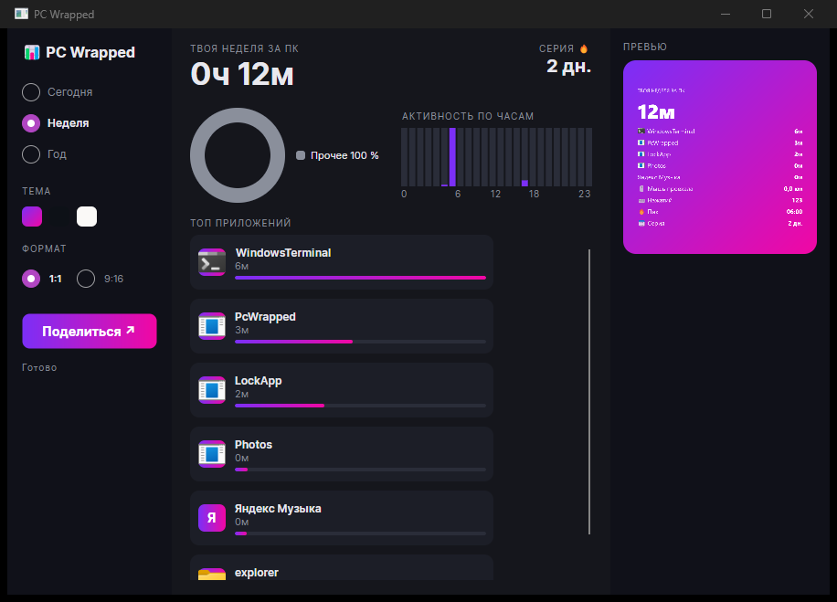
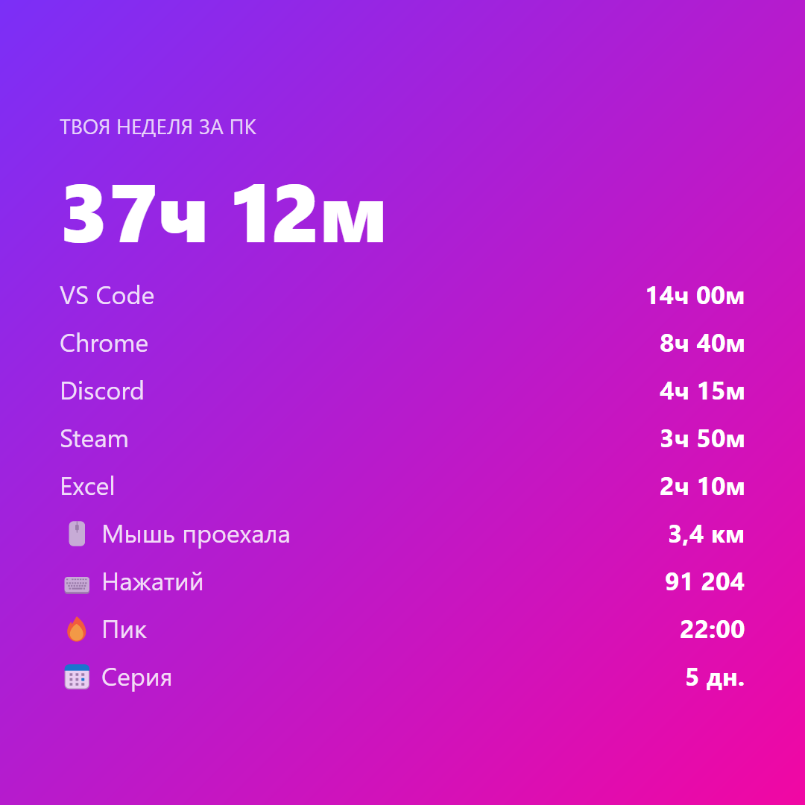
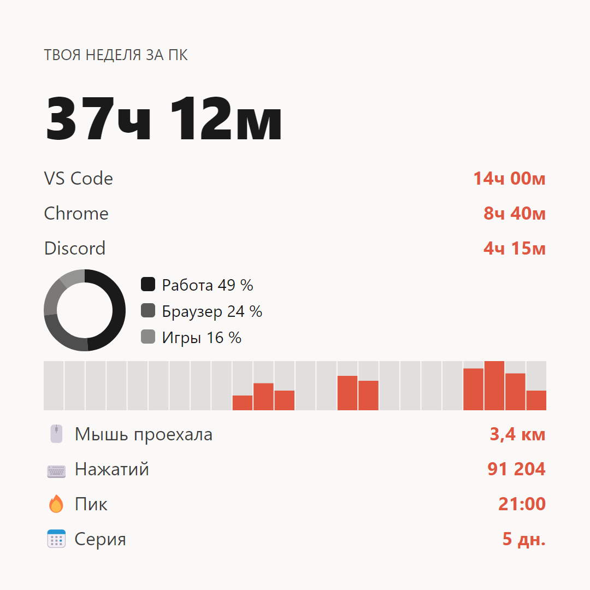
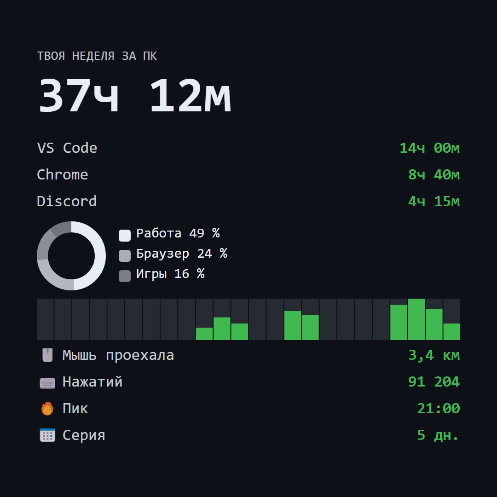

# PC Wrapped

**Spotify Wrapped для твоего компьютера.** Локально считает, как ты проводишь
время за ПК, и генерирует красивые карточки, которыми можно поделиться.



## Скачать / установить

Готовые сборки — на странице [Releases](https://github.com/090TYPE/pc-wrapped/releases):
- **PcWrapped.exe** — портативная версия, просто запусти (ничего ставить не нужно).
- **PCWrapped-Setup.exe** — установщик (ярлык в меню Пуск, удаление через «Программы и компоненты»).

> ⚠️ Приложение пока без цифровой подписи, поэтому при первом запуске Windows SmartScreen
> может показать «Windows защитила ваш компьютер». Нажми **Подробнее → Выполнить в любом случае**.
> Код открыт — можно собрать самому.

### Сборка портативного exe локально
```
powershell -ExecutionPolicy Bypass -File scripts\publish.ps1
```
Результат: `dist\PcWrapped.exe`.

## Возможности

- 🗂 Время по приложениям с **настоящими иконками** .exe и категориями
  (работа / игры / соцсети / браузер)
- 📅 Периоды: **Сегодня / Неделя / Год**
- 🔥 Самый продуктивный час, серии активных дней (streak)
- 🖱️⌨️ «Vanity»-метрики: километры пробега мыши, число нажатий и кликов
- 🎨 3 темы карточек, **живое превью** и экспорт в PNG (1:1 для ленты и 9:16 для сторис)
- 🔔 Живёт в системном трее, автозапуск с Windows

## Карточки для шеринга

| Градиент | Минимал | Dev / неон |
|----------|---------|------------|
|  |  |  |

## Приватность

- **100% локально.** Данные хранятся в `%APPDATA%\PcWrapped\stats.db` и никогда
  не отправляются в сеть.
- Считаются **только счётчики** ввода (число нажатий / кликов / расстояние мыши).
  Содержимое набранного текста нигде не сохраняется. Код открыт — проверь сам.
- Трекинг ввода можно отключить на первом запуске.

## Сборка и запуск

```
dotnet build PcWrapped.slnx
dotnet run --project src/PcWrapped
```

## Тесты

```
dotnet test PcWrapped.slnx
```

## Стек

.NET 8 · Avalonia 11 · SQLite · C# (Windows desktop)
